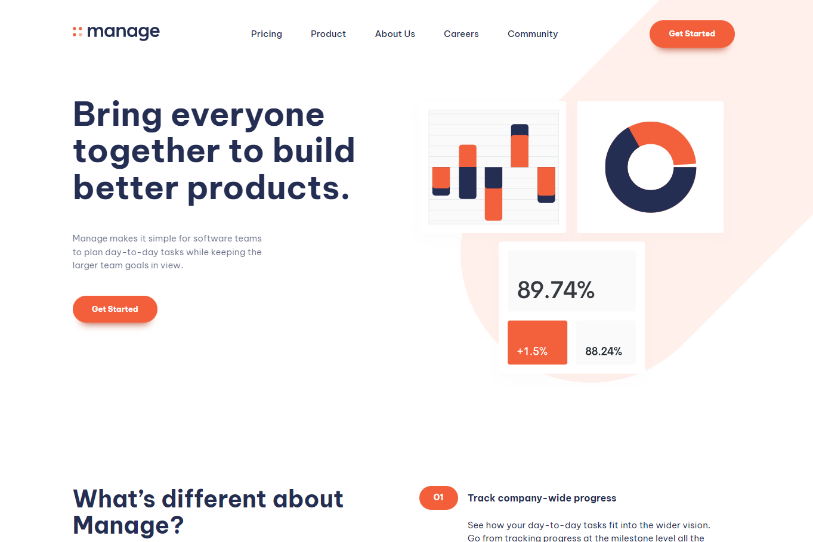

<h1 align="center">📈  Manage  📊</h1>

Software to plan day to day tasks, project.

This project was made following Front End Mentor's design, you can see the challenge by <a href="https://www.frontendmentor.io/challenges/manage-landing-page-SLXqC6P5">clicking here.</a>

<h2>⚙️Tecnologias</h2>

<h2>🚀Brief</h2>

Your challenge is to build out this landing page and get it looking as close to the design as possible.

Your users should be able to:
- View the optimal layout for the site depending on their device's screen size
- See hover states for all interactive elements on the page
- See all testimonials in a horizontal slider
- Receive an error message when the newsletter sign up form is submitted if:
  - The input field is empty
  - The email address is not formatted correctly

<h2>❔ How to Use </h2>

Before cloning the repository into your machine you'll need <a href="https://git-scm.com/">Git</a>. Also it is good to have a code editor like <a href="https://code.visualstudio.com/">VSCode.</a>
<blockquote>
 Clone this repository

 Go into the repository

 Install dependencies with
  - npm install or yarn

 Run app
 - npm start or yarn dev
</blockquote>

<h2>🗣 Author </h2>

Made with ❤️ by Gustavo Barboza

   
   

